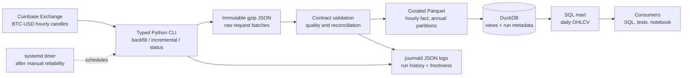

# Bitcoin Data Engineering Platform — Master Plan

Status: proposed baseline
Plan date: 2026-09-16
Owner timezone: Asia/Jakarta
Data timestamps: UTC

## 1. Executive Summary

Build the platform as a sequence of small, complete systems. Version 1 should ingest hourly `BTC-USD` candles from the public Coinbase Exchange REST API, preserve the exact source response, validate and normalize it, write analytical Parquet data, and expose it through DuckDB SQL. A manual CLI comes first; a systemd oneshot service and timer follow after the pipeline is repeatable.

This is intentionally a single-host batch architecture. It needs no Kafka, Spark, Kubernetes, database server, object-store service, or public port. The initial dataset is small enough for one Python process and DuckDB, yet rich enough to teach source contracts, pagination, backfills, watermarks, idempotency, data quality, columnar storage, analytical modeling, orchestration, observability, and recovery.

The planned public repository is `bitcoin-data-platform`. Code and persistent data/state are kept in separate directories to ensure deployments never overwrite runtime state and Git never tracks data.

## 2. Deployment Environment

### Requirements

| Area | Requirement |
|---|---|
| OS | Ubuntu 24.04 LTS or compatible Linux distribution |
| Runtime | Python 3.12+, Git |
| Storage | Sufficient persistent disk for raw JSON envelopes and curated Parquet files |
| Network | Outbound HTTPS only; no inbound application port required |
| Security | Dedicated unprivileged Unix account; secrets excluded from Git |

### Pre-deployment checks

Before creating directories or services, verify:

1. Available disk space and filesystem layout.
2. Python version and virtual environment support.
3. Network egress to Coinbase Exchange API.
4. No conflicting port bindings or service names.

## 3. Constraints

### Compute and memory

- Four vCPUs are enough for Python, DuckDB, Parquet, tests, and modest local analytics.
- Memory is generous relative to V1 data volume, but DuckDB should still have an explicit memory limit so a malformed query cannot contend with other services.
- No swap means an out-of-memory event has less graceful fallback. Keep transformations bounded and monitor RSS.

### Storage

- The persistent root disk, not RAM, is the primary constraint: roughly 61 GiB usable.
- `/mnt` is ephemeral. It may hold disposable caches only and must never hold the only copy of raw, curated, state, credentials, or backups.
- Hourly candles are tiny, but raw response retention, logs, Docker layers, future domains, and backups can accumulate. Establish disk thresholds before adding high-volume trades or blockchain data.
- The server currently has no documented off-host data backup for this project. Git protects code, not datasets or operational state.

### Operations

- This is a single-host system. Maintenance or host failure pauses ingestion.
- The owner is learning the system, so every automated path needs a manual equivalent and a recovery runbook.
- Existing workloads share CPU, memory, root storage, journald, and operational attention.
- Live SSH must be restored or explicitly provided before deployment verification can be trusted.

### Network and security

- V1 requires outbound HTTPS only and no inbound application port.
- The analytical database must not be exposed to the Internet.
- API credentials are unnecessary for the selected source. Later secrets belong in root/service-readable environment files or a secret manager, never in Git.
- A dedicated non-login Unix account should run the pipeline. It should not join `sudo` or `docker` groups.
- Password SSH is an acknowledged residual risk. Any hardening is a separate reviewed infrastructure change, not part of this data project.

## 4. Recommended First Data Domain

### Decision

Start with **hourly Coinbase Exchange `BTC-USD` OHLCV candles**.

Use the public Exchange endpoint `GET /products/BTC-USD/candles` with `granularity=3600`. Backfill explicit windows of at most 300 candles. For incremental runs, retrieve a bounded overlap of recently closed hours and deduplicate on `(source, product_id, granularity_seconds, candle_start_utc)`.

### Candidate comparison

| Candidate | Provider and access | History / limits | Strengths | Limitations | Verdict |
|---|---|---|---|---|---|
| BTC-USD OHLCV | Coinbase Exchange; official exchange REST API; public market data, no API key | Maximum 300 candles/request; public limit documented as 10 requests/s with burst to 15; multiple granularities including 1 hour | Clear schema and grain, enough history and volume, pagination/backfill exercise, easy validation, direct research value | Exchange-specific rather than global; source warns historic intervals may be incomplete; candles can be revised until closed | **First** |
| Bitcoin network metrics | Coin Metrics Community API; third-party network-data provider; no key for community endpoints; free non-commercial CC use | Pagination; community limit 10 requests per 6 seconds per IP; long BTC history varies by metric | High Bitcoin research value, defined metrics, built-in catalog, useful second domain | Metrics are provider-derived, not raw blockchain truth; community coverage varies; many metrics can blur the first data contract | Phase 6 |
| BTC market OHLCVT | Kraken public API and downloadable archives; official exchange source | REST OHLC is limited to recent windows; historical ZIP files are available separately | Official source, useful for source reconciliation | Two acquisition paths complicate the first pipeline; exchange symbol conventions and incomplete REST history add friction | Alternative / later reconciliation |
| Fear & Greed index | Alternative.me; public JSON/CSV endpoint, attribution required | Full available history through `limit=0`; no rate limit stated in the referenced page | Very easy, low volume, useful enrichment | Opaque methodology and third-party continuity; too little engineering depth as the first domain | Later enrichment |
| Macroeconomic series | FRED/ALFRED; official US public-sector API; registered API key required | Rich historical and vintage data; documented 120 requests/minute for API v1 | Excellent for revisions, vintages, and macro research | Not Bitcoin-native; credentials and mixed frequencies distract from the first vertical slice | Later macro domain |
| Self-derived node data | Bitcoin Core, official protocol software | Full node history requires far more persistent disk than available; pruning removes arbitrary historical query ability | Maximum provenance and reproducibility | Operationally and storage-heavy; not justified for V1 | Reconsider after storage expansion |

### Why hourly candles are first

- **Learning value:** window pagination, UTC time semantics, late/current buckets, idempotency, gap handling, and aggregate modeling.
- **Reliability:** an official exchange market-data interface with explicit limits and error behavior.
- **Accessibility:** no account or secret is required.
- **Reproducibility:** historical windows can be requested deterministically and raw responses retained.
- **Useful scale:** roughly 8,760 rows per full year—large enough to query and test, small enough to inspect.
- **Extensibility:** the same canonical candle contract can later accept Kraken or another venue for reconciliation.
- **Portfolio clarity:** recruiters immediately understand OHLCV, while the implementation still exposes genuine data-engineering concerns.

The dataset represents Coinbase trading activity, not a universal Bitcoin price. That limitation must be visible in table names, metadata, and documentation.

## 5. Architecture V1



### Component choices

| Choice | What and why | Concept | Trade-off | Reconsider when |
|---|---|---|---|---|
| One Python package and CLI | A small, testable application owns acquisition and control flow | Separation of concerns, dependency injection, reproducibility | Less visual than an orchestrator UI | Several interdependent pipelines need dependency-aware backfills |
| Raw gzip JSON | Preserve exact successful responses plus request metadata and checksum | Lineage, replay, immutable raw layer | Duplicates data and needs retention policy | Object storage or larger domains justify lifecycle management |
| Parquet | Typed, compressed columnar curated storage | Column vs row storage, predicate pushdown | File rewrite/compaction is explicit | Concurrent writers or table-level transactions are needed |
| DuckDB | SQL transformation, local OLAP, views, and small control tables | OLAP, analytical SQL | Single-host/single-writer constraints | A shared multi-user service or high write concurrency is needed |
| systemd timer | Native scheduler already present; journal and failure state included | Orchestration and operational ownership | No DAG UI or cross-pipeline asset model | Scheduling relationships become complex |

Detailed behavior is in [ARCHITECTURE_V1.md](architecture/ARCHITECTURE_V1.md).

## 6. Data Flow

1. A run receives an explicit mode: `backfill --start --end` or `incremental`.
2. The planner converts the requested UTC interval into windows of at most 300 hourly points and excludes the current open candle.
3. The client requests windows sequentially, caps itself well below the provider rate limit, and applies bounded retry/backoff to transient failures.
4. Each successful response is written atomically as an immutable gzip JSON envelope containing request parameters, response time, source endpoint identifier, HTTP metadata allowlist, payload, run ID, and SHA-256 checksum.
5. Boundary validation maps the source arrays to named typed fields. Invalid batches are retained but are not promoted.
6. Valid rows are normalized and deduplicated by the candle key. Annual Parquet partitions are atomically replaced after merging the overlap.
7. DuckDB views expose the hourly fact and derive the daily mart. Control tables record run state, row counts, freshness, and the committed watermark.
8. Quality gates determine the exit code. Only a fully promoted run advances the watermark.
9. Logs go to stdout as JSON; systemd captures them in journald. The `status` command summarizes last success, freshness, gaps, and disk use.

## 7. Storage Strategy

### V1 layout

```text
data/
├── raw/coinbase_exchange/candles/BTC-USD/ingestion_date=YYYY-MM-DD/*.json.gz
├── curated/market/candles_hourly/source=coinbase_exchange/year=YYYY/*.parquet
├── state/platform.duckdb
├── quarantine/
└── tmp/
```

- Raw files are append-only and named by run ID plus request-window hash.
- Curated annual partitions avoid a small-file explosion while keeping repairs bounded.
- Temporary output is written beside its destination, fsynced where practical, then atomically renamed.
- `tmp` is disposable; all other directories are persistent.
- Runtime data is excluded from Git.

### Evolution

1. **Now:** local filesystem + gzip JSON + Parquet + DuckDB.
2. **Later, for shared operational access:** PostgreSQL for metadata/API workloads, not as a reflexive replacement for Parquet analytics.
3. **Later, for S3-compatible semantics or multiple hosts:** external object storage or MinIO, only with a tested backup plan.
4. **Later, for concurrent writers and table transactions:** Iceberg or Delta after object storage and an engine ecosystem exist.
5. **Later, for very large interactive data:** ClickHouse when measured latency and row volume justify another service.

## 8. Data Modeling Strategy

### Canonical hourly fact

`fact_market_candle_hourly` grain: one completed one-hour candle per source and product.

| Column | Meaning |
|---|---|
| `source` | `coinbase_exchange` |
| `product_id` | `BTC-USD` |
| `granularity_seconds` | `3600` |
| `candle_start_utc` | UTC bucket start; part of natural key |
| `open`, `high`, `low`, `close` | Decimal prices, never binary float at the contract boundary |
| `volume_base` | BTC volume for the bucket |
| `ingested_at_utc` | Promotion timestamp |
| `source_run_id` | Lineage back to raw envelope and run table |

Natural uniqueness key: `(source, product_id, granularity_seconds, candle_start_utc)`.

Do not force a star schema around one product. Add a `dim_market` or slowly changing dimensions only when multiple venues/products introduce attributes with independent lifecycle. The first derived mart is `mart_btc_usd_daily`, computed from hourly data to demonstrate grain changes and reconciliation.

## 9. Orchestration Strategy

1. Prove backfill and incremental modes manually.
2. Add a systemd oneshot service running as `bitcoin-data`.
3. Add a timer at ten minutes after every hour, with `Persistent=true` so a missed run is triggered after reboot.
4. Prevent overlap with a DuckDB advisory run record or OS file lock; a second run exits cleanly.
5. Use explicit non-zero exit codes for acquisition, contract, promotion, and quality failures.
6. Keep backfills operator-triggered so a broad date-range mistake cannot repeatedly consume resources.

Cron is simpler but provides weaker unit state and log association. Airflow, Dagster, and Prefect are not justified for one dependency chain.

## 10. Data Quality Strategy

### Blocking checks

- Payload shape has exactly six values per source candle and expected parseable types.
- Required fields are non-null.
- Natural key is unique after normalization.
- `high >= max(open, close, low)` and `low <= min(open, close, high)`.
- Prices are positive and volume is non-negative.
- Timestamp is UTC-aligned to the hourly grain and is earlier than the current open hour.
- Requested windows and returned records reconcile after documented boundary behavior.
- No duplicate partition keys exist after merge.

### Warning or policy-based checks

- Missing hourly intervals. Coinbase documents that historical intervals may be absent when no ticks exist; record the gap before deciding whether it is anomalous.
- Large return/volume changes. These are anomaly signals, not automatic evidence of bad data.
- Freshness beyond two completed hours.
- Unexpected schema/catalog behavior.

Quality results belong in run metadata and structured logs. Unit tests validate rules; integration fixtures validate the source contract; live API checks are smoke tests and must not make CI flaky.

## 11. Observability Strategy

Start with three surfaces:

1. **Structured logs:** run ID, mode, window, attempt, HTTP status category, rows received/validated/written, duration, and error class. Never log headers or secrets.
2. **Run metadata:** status, start/end, committed watermark, source max time, row counts, gap count, raw checksum, and code version.
3. **Status command:** last successful run, current freshness, last failure, recent row counts, unresolved gaps, and storage use.

Systemd and journald provide scheduling and bounded log retrieval. Add an `OnFailure` notification only after choosing a low-noise channel. Prometheus and Grafana wait until multiple services or time-series operational metrics make dashboards useful.

## 12. Repository Structure

```text
bitcoin-data-platform/
├── .github/workflows/ci.yml
├── config/
│   └── example.toml
├── contracts/
│   └── market_candle_hourly.schema.json
├── docs/
│   ├── MASTER_PLAN.md
│   ├── architecture/ARCHITECTURE_V1.md
│   ├── decisions/README.md
│   ├── learning/DE_CONCEPT_MAP.md
│   ├── roadmap/ROADMAP.md
│   ├── runbooks/
│   └── sources/
├── infra/
│   └── systemd/
├── notebooks/
│   └── README.md
├── sql/
│   ├── models/
│   └── quality/
├── src/bitcoin_data_platform/
│   ├── cli.py
│   ├── config.py
│   ├── logging.py
│   ├── sources/
│   ├── ingestion/
│   ├── storage/
│   ├── transforms/
│   └── quality/
├── tests/
│   ├── fixtures/
│   ├── integration/
│   └── unit/
├── .env.example
├── .gitignore
├── LICENSE
├── Makefile
├── pyproject.toml
└── README.md
```

Important boundaries:

- `src` contains application code; no notebook-only business logic.
- `contracts` declares external/canonical schemas and compatibility expectations.
- `sql` contains reviewable transformations and quality assertions.
- `tests/fixtures` contains sanitized, small, immutable examples; no live secrets.
- `infra` contains deployable unit templates but not VPS-specific credentials.
- `docs/decisions` records why choices were made and when to reconsider them.
- Runtime `data`, `.venv`, DuckDB files, logs, and secrets are never committed.

### Initialization plan

Do not initialize Git until the next phase begins. Then:

1. Revalidate the live VPS and confirm the target paths do not conflict.
2. Initialize the local `bitcoin-data-platform` directory on branch `main`.
3. Add the documentation baseline, license choice, `.gitignore`, ownership statement, and source terms.
4. Add a minimal Python package and reproducible dependency lock.
5. Commit the architecture baseline before ingestion code, preserving an intelligible project history.
6. Create the public remote only after checking the tree for secrets and machine-specific data.
7. Deploy by a documented clone/release process; do not treat an interactive server edit as source of truth.

## 13. Technology Decision Matrix

| Technology | Purpose | Now? | Later? | Reason / trigger | Simpler alternative |
|---|---|---:|---:|---|---|
| Python 3.12 | API client and pipeline control | Yes | Yes | Matches host; readable and employable | Shell, but weak for contracts/tests |
| gzip JSON | Immutable raw source capture | Yes | Yes | Exact replayable responses at negligible scale | Plain JSON, larger on disk |
| Parquet | Curated analytical files | Yes | Yes | Typed columnar storage and ecosystem portability | CSV, but weaker types/compression |
| DuckDB | SQL transforms and local OLAP | Yes | Yes | In-process, queries Parquet directly | SQLite, weaker analytical scans |
| pytest + SQL assertions | Code and data tests | Yes | Yes | Transparent and lightweight | A data-quality framework |
| systemd timer | Single-host schedule and supervision | After manual proof | Yes | Already installed; no new service | cron |
| GitHub Actions | Lint/test/security checks | Phase 5 | Yes | Public portfolio delivery discipline | Local-only scripts |
| Docker | Reproducible packaging | No | Phase 5 | Introduce after behavior is stable and image cost is understood | venv + systemd |
| PostgreSQL | Shared relational serving/control data | No | Conditional | Needed for concurrent clients or an API | DuckDB |
| dbt-core | Multi-model SQL DAG, tests, docs, lineage | No | Phase 6 | Useful once several related models/domains exist | Versioned SQL scripts |
| Dagster | Asset orchestration and backfill UI | No | Conditional | Consider beyond roughly five interdependent pipelines/assets | systemd timers |
| Airflow / Prefect | Workflow orchestration | No | Conditional | Choose only after comparing concrete needs; do not run multiple orchestrators | systemd timers |
| MinIO | Self-hosted S3 API | No | Conditional | Multiple hosts/S3 semantics and backup operations justify it | Filesystem |
| Managed object storage | Durable raw/curated object store | No | Conditional | Off-host durability may be cheaper operationally than MinIO | Filesystem + backup |
| Kafka / Redpanda | Durable event log and multiple consumers | No | Streaming phase only | Justified by real event consumers, replay, and throughput | WebSocket client + files |
| Spark | Distributed transforms | No | Far later | Only when measured data/job size exceeds single-node engines | DuckDB/Polars |
| Iceberg / Delta | Transactional lakehouse tables | No | Far later | Multi-writer schema evolution and snapshots on object storage | Versioned Parquet |
| ClickHouse | High-volume low-latency analytical serving | No | Conditional | Consider at 100M+ rows or measured interactive latency need | DuckDB |
| Prometheus + Grafana | Metrics collection and dashboards | No | Conditional | Useful for several continuously operated components | Logs + run tables |
| Redis | Cache/queue/lock service | No | Conditional | Add only for a measured shared-state need | Process/file/DB locks |
| Trino | Federated distributed SQL | No | Far later | Multiple large catalogs and compute workers | DuckDB |
| Kubernetes | Multi-service orchestration and HA | No | Unlikely on this VPS | Needs genuine scaling/HA and operating capacity | systemd/Compose |
| Vector database | Semantic retrieval | No | AI phase, conditional | Only for a defined metadata/research retrieval corpus | Full-text search/files |

## 14. Development Roadmap

The authoritative phase detail, prerequisites, tests, interview outcomes, and definitions of done are in [ROADMAP.md](roadmap/ROADMAP.md).

Summary:

1. Foundation and repository bootstrap.
2. Deterministic raw backfill.
3. Curated Parquet and DuckDB model.
4. Reliable incremental orchestration.
5. Quality and observability hardening.
6. Reproducible delivery and CI/CD.
7. Second domain and richer analytics engineering.
8. Research serving and portfolio demonstration.
9. Event-driven experiment only after a batch baseline.
10. Lakehouse/distributed evolution only when measured limits require it.
11. AI-assisted operations and research, with human-reviewed outputs.

## 15. Milestones and Definition of Done

| Milestone | Objective acceptance criteria |
|---|---|
| M0 — Architecture baseline | Four required docs and decision log reviewed; live-audit limitation recorded; source and grain chosen; no infrastructure mutation |
| M1 — Raw ingestion | Explicit historical range creates checksummed raw envelopes; window planner obeys 300-candle cap; retries and fixtures tested; rerun is safe |
| M2 — Analytical model | Typed hourly Parquet fact and daily mart query in DuckDB; deterministic rebuild from raw; schema/key/range tests pass |
| M3 — Reliable batch | Incremental overlap load advances watermark only after promotion; concurrent run blocked; backfill and failure recovery documented |
| M4 — Scheduled operation | Dedicated account, reviewed systemd service/timer, missed-run behavior tested, no inbound port, journald logs verified |
| M5 — Quality and observability | Freshness, uniqueness, gaps, ranges, counts, status CLI, run history, and failure notification policy verified |
| M6 — Delivery | CI passes from clean clone; dependency lock and release/deploy runbook work; secret scan clean; container decision demonstrated rather than assumed |
| M7 — Multi-domain | One justified second source uses a documented contract and conformed UTC/date semantics; cross-domain model and lineage are testable |
| M8 — Research product | Reproducible notebook or dashboard answers documented questions without embedding transformation logic |
| M9 — Streaming experiment | A narrowly scoped experiment measures latency, loss, replay, and operating cost; keep/remove decision documented |
| M10 — AI assistance | Agent operates read-only by default, cites data/run lineage, cannot trade or mutate production without explicit approval, and is evaluated on test incidents |

## 16. Data Engineering Concept Map

Concepts are introduced when a real project problem appears rather than as a checklist. Each phase in the roadmap lists the concepts it teaches.

## 17. AI Integration Roadmap

### Useful later

- Explain a failed run by combining run metadata, bounded logs, and data-quality results.
- Draft a freshness or anomaly incident summary with links to exact run IDs and partitions.
- Translate natural-language research questions into read-only SQL, enforce query limits, and show generated SQL.
- Discover datasets and draft contracts for human review.
- Summarize monthly Bitcoin observations from reproducible SQL outputs and cite data timestamps/sources.
- Propose remediation steps, but require approval before reruns, backfills, deletes, deployment, or service control.

### Anti-patterns to avoid

- An agent that simply wraps a deterministic API call.
- LLM-based anomaly detection before statistical baselines and explicit rules exist.
- Letting an agent edit curated data directly.
- Autonomous trading, buy/sell decisions, or portfolio actions.
- A vector database without a defined corpus, retrieval evaluation, and maintenance owner.
- Giving an AI agent database write access or secrets merely for convenience.

### Safe integration sequence

1. Read-only documentation and metadata assistant.
2. Read-only SQL with row/time limits and audit logs.
3. Incident triage against synthetic failures.
4. Human-approved operational suggestions.
5. Narrow, reversible execution capabilities only after authorization and evaluation.

The batch platform must continue to run when AI services are unavailable.

## 18. Future Scaling Path

Scale only against measured thresholds:

- **More models, same data:** introduce dbt when SQL dependencies and documentation become expensive to manage manually.
- **More sources and schedules:** introduce an asset orchestrator when systemd units cannot clearly express dependencies/backfills.
- **More readers/writers:** add PostgreSQL or an analytical service when DuckDB file access becomes a coordination bottleneck.
- **More durable storage:** add off-host object storage before self-hosting a storage service solely for appearance.
- **High-frequency events:** trial a WebSocket collector; add Kafka/Redpanda only for replayable multi-consumer event flows.
- **Hundreds of millions of rows / latency pressure:** benchmark ClickHouse, Polars, and DuckDB first.
- **Multi-writer data lake:** consider Iceberg/Delta only after object storage, catalog, compaction, and recovery operations are understood.
- **Distributed compute:** Spark is justified by measured single-node limits, not by a roadmap date.

## 19. Risks and Technical Debt

| Risk | Mitigation / accepted debt |
|---|---|
| Live audit could be stale | Revalidate before any VPS mutation; block deployment on unexplained drift |
| Coinbase is a single venue | Name source explicitly; add reconciliation source later; never label it universal price |
| Historical candle omissions or revisions | Preserve raw, use overlap windows, track gaps/revisions, exclude open candle |
| Provider/API changes | Contract fixtures, source metadata, explicit error categories, documented version review |
| Root disk fills | Disk checks, annual partitions, raw retention review, bounded logs, off-host backup plan |
| Single host fails | Rebuildable code, raw/curated backup, restore drill, missed-run catch-up |
| DuckDB single-writer behavior | Serialize pipeline writes; move shared service workloads when concurrency is real |
| No swap | Memory limits and bounded transformations; reassess only with infrastructure review |
| Public portfolio leaks machine details | Keep public docs generic where needed; never commit IPs, usernames, secret paths, tokens, or runtime dumps |
| Over-engineering | Every new component needs a problem statement, simpler alternative, trigger, operating cost, and rollback |

## 20. Recommended Next Implementation Step

## NEXT ACTION

Implement **Phase 1 — Repository bootstrap and deterministic raw ingestion contract** only: initialize the local Git repository, add the minimal typed Python package and CI-quality tooling, capture a sanitized Coinbase candle fixture, specify the canonical hourly-candle contract, and build/test a manual `backfill --start --end` command that writes checksummed immutable raw envelopes. Do not yet deploy a timer, transform to Parquet, or add another data source.
