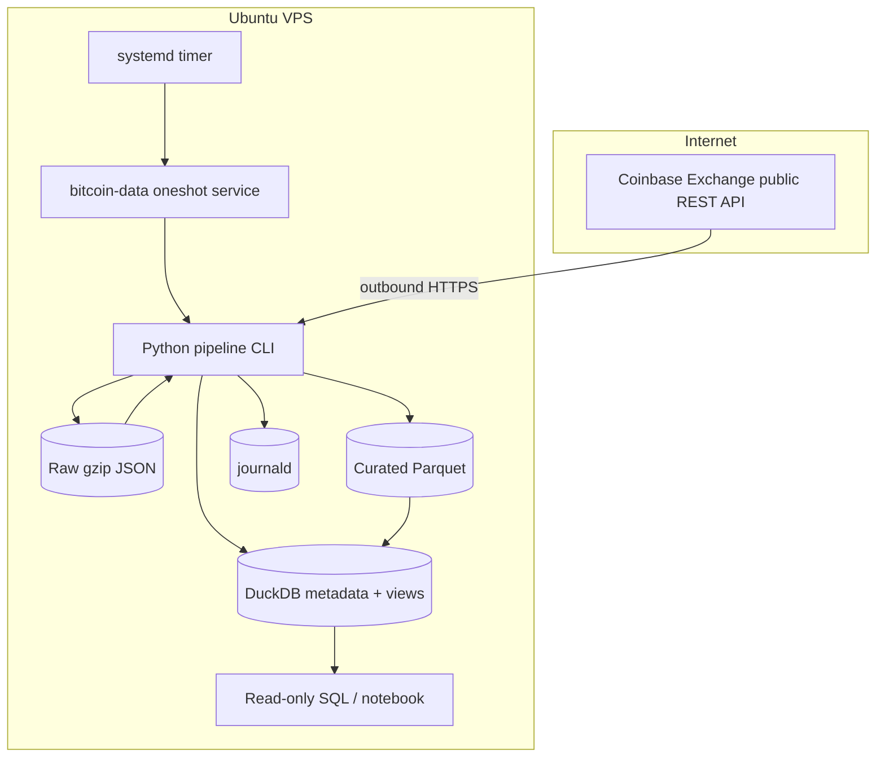

# Architecture V1 — Single-Host Hourly Bitcoin Batch Platform

Status: proposed
Scope: Coinbase Exchange `BTC-USD`, one-hour completed candles
Deployment target: one Ubuntu VPS

## Goals

- Build a complete, explainable batch path with a small operational footprint.
- Make every run repeatable, idempotent, observable, and recoverable.
- Preserve source evidence before transforming it.
- Support bounded historical backfills and routine incremental loads.
- Produce portable analytical data and SQL models.
- Open no public application ports.

## Non-goals

- Trading, orders, signals, or investment recommendations.
- Real-time guarantees.
- A universal or consolidated Bitcoin price.
- Multi-host availability, distributed compute, or lakehouse semantics.
- AI as a required runtime dependency.

## System context



No connection from the Internet terminates at the data platform. Consumers initially connect through SSH and query local files/DuckDB.

## Source contract

### Endpoint

- Base: `https://api.exchange.coinbase.com`
- Resource: `/products/BTC-USD/candles`
- Required query: `granularity=3600`, explicit `start`, explicit `end`
- Maximum: 300 data points in one request
- Returned candle order must not be assumed; normalize and sort explicitly.
- Coinbase documents that historical rates may be incomplete and may include points preceding the requested start.

### Source tuple

The response is an array of arrays. The documented field order is:

```text
[time, low, high, open, close, volume]
```

The ingestion boundary maps positions to names immediately. Numeric strings/numbers are parsed as decimals; time is parsed as a UTC epoch-second bucket.

### Request policy

- Identify the client with a stable, non-secret user agent and project URL after publication.
- Apply connect/read/total timeouts.
- Limit normal throughput to at most two requests per second, well below the documented public allowance.
- Retry connection resets, timeouts, HTTP 408, 429, and 5xx up to five total attempts.
- Honor `Retry-After` where present; otherwise use exponential backoff with jitter and a cap.
- Do not retry other 4xx responses automatically.
- Never log request/response headers wholesale.

## Run modes

### Backfill

Input is an explicit half-open UTC interval `[start, end)`. Reject naive timestamps, reversed ranges, current/future open candles, and ranges outside configured safety limits unless an operator supplies an explicit override.

The planner creates consecutive windows with no more than 300 expected hours. It records the plan before acquisition. Re-running the same interval may create another raw observation but must converge to the same canonical candle keys.

### Incremental

The committed watermark is the maximum promoted completed candle. Each run starts earlier than the watermark by a configured overlap (initially 48 hours) and ends at the most recent completed UTC hour. Overlap makes source corrections and partial prior runs safe. Deduplication is deterministic.

An initial incremental run without a watermark fails with a clear instruction to perform a bounded backfill; it must not silently download all history.

### Status

Read-only command returning machine-readable JSON and a human summary:

- last run and last success;
- committed watermark;
- source and curated maximum candle;
- freshness duration;
- most recent gap/quality failures;
- recent row counts and run durations;
- filesystem utilization.

## Raw layer

### Envelope

Each successful HTTP response is stored before parsing/promotion:

```json
{
  "schema_version": 1,
  "run_id": "uuid",
  "source": "coinbase_exchange",
  "endpoint": "product_candles",
  "request": {
    "product_id": "BTC-USD",
    "granularity_seconds": 3600,
    "start_utc": "...",
    "end_utc": "..."
  },
  "retrieved_at_utc": "...",
  "http": {
    "status": 200,
    "provider_request_id": "allowlisted-if-present"
  },
  "payload_sha256": "...",
  "payload": []
}
```

Do not include authorization, cookies, full headers, host IP, local usernames, or secrets.

### Atomicity and naming

Write to a unique temporary file in the destination filesystem, close it, and atomically rename it to the final `.json.gz` path. The filename includes run ID, UTC window, and a short request-identity hash. A file is never edited in place.

### Quarantine

A transport-successful response with a contract failure remains in raw and receives a quality record. Optional diagnostic extracts go to `quarantine`; they do not enter curated data.

## Transformation and canonical model

### Staging rules

1. Validate tuple length and field types.
2. Map fields and attach lineage columns.
3. Reject timestamps outside the requested safety boundary after accounting for documented pre-start results.
4. Exclude the current open hour.
5. Sort by timestamp.
6. Resolve duplicate keys deterministically: most recent successful retrieval wins, while retaining revision metadata in run history.

### Canonical fact

```text
fact_market_candle_hourly
PK: source, product_id, granularity_seconds, candle_start_utc

source                  VARCHAR
product_id              VARCHAR
granularity_seconds     INTEGER
candle_start_utc        TIMESTAMPTZ
open                    DECIMAL(38, 18)
high                    DECIMAL(38, 18)
low                     DECIMAL(38, 18)
close                   DECIMAL(38, 18)
volume_base             DECIMAL(38, 18)
ingested_at_utc         TIMESTAMPTZ
source_run_id           UUID/VARCHAR
```

Parquet readers may materialize decimals differently, so contract tests must verify the chosen DuckDB/Arrow types and precision.

### Daily mart

`mart_btc_usd_daily` groups UTC hours:

- `open`: first hourly open by timestamp;
- `high`: maximum high;
- `low`: minimum low;
- `close`: last hourly close;
- `volume_base`: sum volume;
- `observed_hour_count`: count of present hours;
- `is_complete`: expected number of completed hours for that day is present.

Partial current days stay distinguishable; they are never presented as complete daily candles.

## Idempotency, watermark, and commit protocol

### Idempotency

The canonical natural key prevents repeated windows from duplicating analytical rows. Identical raw payloads may be detected by checksum, but raw capture policy remains append-only for auditability.

### Watermark

The watermark means “latest completed candle successfully promoted with blocking checks passed,” not “latest timestamp requested.” It moves monotonically in routine incremental loads. Repair/backfill runs do not lower it.

### Promotion

1. Create run row with `RUNNING` state.
2. Acquire and atomically store raw envelopes.
3. Validate source and normalized rows.
4. Read affected annual partitions.
5. Merge and deduplicate into temporary partitions.
6. Run blocking checks against temporary output.
7. Atomically replace affected partition files.
8. Update DuckDB run metadata and watermark in one transaction.
9. Mark run `SUCCEEDED` and emit summary.

If failure occurs before step 7, curated data is unchanged. If filesystem replacement succeeds but metadata update fails, a repair command reconciles partitions against raw lineage before another normal run.

## Data-quality rules

| Rule | Severity | Response |
|---|---|---|
| Source tuple length/types | Block | Quarantine batch, fail promotion |
| Required values present | Block | Reject row/batch according to configured threshold; V1 fails batch |
| Natural key unique | Block | Deterministically deduplicate then verify |
| Hour-aligned UTC timestamp | Block | Reject row |
| Current/open candle absent | Block | Exclude and record |
| Positive OHLC, non-negative volume | Block | Reject row |
| High/low invariant | Block | Reject row |
| Requested/returned boundary | Block on unexplained outlier | Document provider pre-start behavior |
| Hour gaps | Warning initially | Record gap; promote only under explicit source-gap policy |
| Freshness > 2 completed hours | Alert | Non-zero status/notification policy, not historical backfill failure |
| Row-count deviation | Warning / alert | Compare with window expectation and recent baselines |

## Orchestration and concurrency

The deployed unit runs as a dedicated `bitcoin-data` user with no login shell, sudo, or Docker group. The service receives configuration through a non-secret TOML file and narrowly permissioned environment file if later needed.

Suggested timer behavior after manual proof:

- run at minute 10 hourly;
- `Persistent=true`;
- randomized delay of a few minutes to avoid synchronized clients;
- oneshot service with CPU/memory protections;
- writable paths limited to project data/state directories;
- no network listener;
- a lock prevents overlapping service and operator runs.

Backfills are separate operator commands and are not attached to the hourly timer.

## Observability and failure semantics

### Structured events

Every event includes `timestamp`, `level`, `event`, `run_id`, `mode`, and code version. Window events add boundary and row-count fields. Errors add stable error class and retryability, not stack traces alone.

### Exit classes

Use distinct non-zero codes for:

- invalid operator input/configuration;
- source unavailable after retry;
- source contract failure;
- storage/promotion failure;
- data-quality failure;
- concurrency refusal.

### Run table

Store run ID, code version, mode, requested interval, state, timestamps, attempts, source/valid/written row counts, gap count, raw paths/checksums, old/new watermark, and error class/message. Error messages must be scrubbed.

## Security model

- Outbound TLS to a fixed allowlisted source host.
- No Coinbase credential because only public market data is used.
- No public port and no remote DuckDB listener.
- Code is operator-owned and read-only to the service account; data directories are service-owned.
- Secrets, state, data, notebooks outputs, and local configuration are ignored by Git.
- Public docs use placeholders for server identity and addresses.
- Dependencies are locked, scanned, and updated deliberately.
- AI services have no place in the runtime dependency graph.

## Backup and recovery

Code and docs are rebuilt from Git. State and data need a separate policy:

- Raw and curated history are reproducible while the source retains history, but source changes make retained raw valuable.
- Back up raw, curated, and DuckDB state off-host with encryption.
- Never count `/mnt` as a backup.
- A restore drill must prove checksums, DuckDB readability, partition queries, and resumption from the committed watermark.
- Keep raw retention indefinite initially because volume is tiny; revisit at a documented disk threshold.

## Capacity assumptions and triggers

V1 hourly data is orders of magnitude below single-node limits. Re-evaluate the architecture if any occurs:

- root filesystem exceeds 70% sustained use or forecast reaches 80% before the next review;
- a normal run exceeds 10 minutes or memory limits;
- more than five interdependent scheduled pipelines exist;
- several writers/readers need simultaneous database access;
- high-frequency trades create tens/hundreds of millions of rows;
- recovery objectives require a second host or continuous availability.

## Alternatives rejected for V1

- **PostgreSQL:** excellent shared database, but requires a service, backup, upgrades, and network policy for a workload DuckDB handles in-process.
- **Docker:** useful packaging, but a virtual environment plus systemd is easier to debug while behavior changes rapidly. Add a container later as a tested artifact.
- **dbt:** useful with a real SQL DAG; two models do not justify its concepts and dependency surface yet.
- **Airflow/Dagster/Prefect:** a single linear pipeline does not need an orchestrator service/UI.
- **Kafka:** there is no event-stream consumer or replay requirement in V1.
- **Spark:** data fits comfortably in memory and on one core.
- **MinIO/Iceberg:** no object-store or concurrent-writer requirement exists.
- **Prometheus/Grafana:** journald, status output, and run tables cover the first operational questions.

## Verification plan

Before scheduling, prove:

1. Window boundaries at exact hours, leap days, and daylight-saving dates (all internal time remains UTC).
2. Retry behavior for 429, 500, timeout, and permanent 400 fixtures.
3. Raw atomicity and checksum verification.
4. Re-running identical and overlapping ranges produces identical canonical keys/values.
5. A forced failure before promotion leaves curated partitions and watermark unchanged.
6. A deterministic rebuild from raw produces the same Parquet data.
7. Daily aggregation handles complete and incomplete days.
8. Status reports stale data and recent failures accurately.
9. A clean environment can install and pass all offline tests.
