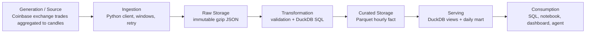

# Data Engineering Concept Map

This map ties concepts to the first project phase where they solve a real problem. “Learn” means the owner can explain, demonstrate, and troubleshoot the concept—not merely name it.

## Lifecycle map

Cross-cutting concerns apply to every arrow: security, data contracts, software engineering, orchestration, quality, observability, lineage, cost, recovery, and documentation.

## Concept progression

| Concept | First phase | Project demonstration | Owner should be able to explain |
|---|---:|---|---|
| Source contract | 1 | Tuple positions, types, terms, rate limits, incomplete-history warning | A contract includes semantics and failure behavior, not only JSON shape |
| Batch processing | 1 | Explicit bounded historical windows | Why batch is cheaper/easier to recover than premature streaming |
| Pagination/windowing | 1 | At most 300 hourly candles per request | Boundary errors, half-open intervals, page completeness |
| Retries/backoff | 1 | Retry transient transport/429/5xx only | Retrying permanent errors worsens incidents; jitter avoids synchronization |
| Idempotency | 1–3 | Re-running a range converges on canonical keys | Idempotency differs from “run once” and from exactly-once delivery |
| Immutable raw data | 1 | Checksummed response envelopes | Raw evidence enables replay, audit, and parser fixes |
| Schema validation | 1–2 | Source tuple and canonical schema checks | Boundary validation prevents silent corruption |
| Row vs column storage | 2 | JSON raw vs Parquet curated | Workload and access pattern determine format |
| Parquet | 2 | Typed annual partitions | Column pruning, compression, metadata, and small-file trade-offs |
| OLTP vs OLAP | 2 | DuckDB analytics; no transactional app DB | Workload shape matters more than database popularity |
| Grain | 2 | One source/product/hour per fact row | Every fact table must have an explicit grain |
| Fact/dimension modeling | 2 and 7 | Hourly fact first; dimensions when multiple markets need them | Do not manufacture dimensions without independent attributes/lifecycle |
| Deduplication | 2–3 | Natural key and deterministic winner | Technical duplicates vs legitimate repeated values |
| Partitioning | 2 | Annual Parquet paths | Partition pruning vs too many small files and skew |
| Incremental loading | 3 | Watermark plus overlap | Incremental is stateful and needs replay/backfill design |
| Watermark | 3 | Latest promoted completed candle | Event/data progress differs from request/run time |
| Late/corrected data | 3 | 48-hour overlap merge | Append-only ingestion can still produce corrected canonical views |
| Backfill | 1 and 3 | Explicit date range and safety limits | Backfills are first-class operations, not exceptional scripts |
| Atomicity | 1–3 | Temp write/rename and transactional metadata | Partial visibility creates hard-to-diagnose corruption |
| Failure recovery | 3 | Repair command and crash tests | Recovery must be designed and rehearsed |
| Orchestration | 4 | systemd timer after manual proof | Scheduling, dependency management, and execution are different concerns |
| Data quality | 2 and 5 | Key, null, range, gap, freshness, reconciliation | Validity, completeness, uniqueness, consistency, and timeliness differ |
| Observability | 4–5 | Structured logs, run tables, status CLI | Monitoring system health alone does not prove data health |
| Reproducibility | 1–6 | Locked dependencies, fixtures, raw rebuild, CI | Same inputs/version should yield equivalent outputs |
| Data contracts | 1 and 7 | External source and canonical contracts | Producer changes need detection and compatibility decisions |
| Lineage | 1–7 | `source_run_id`, raw checksum, model docs | Trace an analytical value to source request and code version |
| Schema evolution | 7 | Second source/canonical contract versioning | Additive and breaking changes require different responses |
| Normalization | 7 | Source-specific fields mapped to a canonical model | Preserve source meaning while enabling comparison |
| Dimensional modeling | 7 | Conformed date/market dimensions if justified | Facts, dimensions, surrogate keys, and conformed semantics |
| Slowly changing dimensions | 7+ | Only when market/entity attributes change historically | Type 1 vs Type 2 trade current truth against historical truth |
| Warehouse | 7+ | Curated conformed analytical models | A warehouse is organized analytical data, not merely a product name |
| Data lake | 1+ | Raw/curated files with governance | Files without contracts/catalog/operations can become a data swamp |
| Lakehouse | 10 | Transactional table format on object storage | Iceberg/Delta add metadata/transactions; they are not synonyms for Parquet |
| Batch vs streaming | 9 | Batch truth vs WebSocket experiment | Event time, processing time, latency, replay, and operating cost |
| Delivery semantics | 9 | Duplicate/gap/replay tests | At-most-once, at-least-once, and end-to-end exactly-once claims |
| DataOps | All | Plan → implement → test → verify → document → commit | Data products require software delivery and operational ownership |

## Interview checkpoints by milestone

### After M0

Explain the business/research purpose, V1 boundary, data lifecycle, current VPS constraints, and why the design excludes distributed tools.

### After M1

Walk through one API request from window planning to raw checksum. Explain timeout categories, retry policy, rate limiting, UTC, and contract tests.

### After M2

State the fact grain and key without looking. Compare JSON, CSV, Parquet, SQLite, PostgreSQL, and DuckDB for this workload. Explain the daily aggregation.

### After M3

Draw the watermark/overlap algorithm. Explain what happens on every failure boundary and why reruns are safe.

### After M4

Describe service identity, filesystem permissions, the timer, missed schedules, logs, concurrency lock, and rollback.

### After M5

Diagnose a stale-but-successful pipeline, a source gap, a duplicate, and disk pressure. Explain which checks block promotion and why.

### After M6

Explain clean builds, locked dependencies, offline vs live tests, CI gates, release artifacts, deployment, and rollback.

### After M7

Explain source-specific contracts, conformed time semantics, metric definitions, lineage across domains, and when dbt became justified.

### After M8

Explain the serving contract, why core logic is outside notebooks, and how consumers learn freshness and provenance.

### After M9

Explain event/processing time, ordering, duplicates, replay, backpressure, and the measured case for or against Kafka.

### After M10/M11

Explain lakehouse table semantics and/or how read-only AI tools are grounded, permissioned, evaluated, and kept out of the critical path.

## Recurring mentoring questions

For every material addition, answer:

1. **What:** What component or contract are we adding?
2. **Why:** Which observed problem does it solve now?
3. **Concept:** Which data-engineering idea does it demonstrate?
4. **Trade-off:** What complexity, cost, or failure mode does it add?
5. **Later:** What measurable condition would make us replace or expand it?
